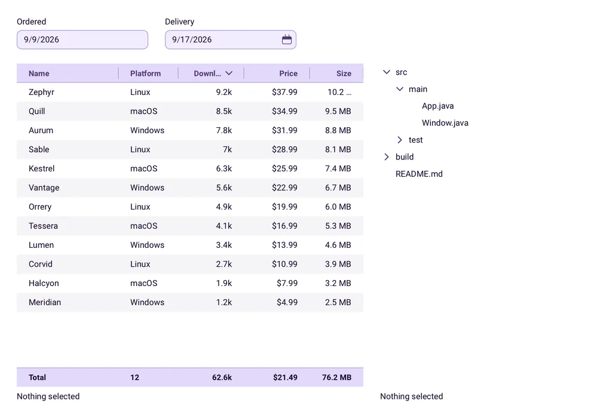

<p align="center">
  <picture>
    <source media="(prefers-color-scheme: dark)" srcset="media/readme/lockup-dark.svg">
    
  </picture>
</p>

<div dir="rtl">

<p align="center"><b>تطبيقات سطح مكتب بلغة Java، مرسومة من الصفر.</b></p>

<p align="center">
  <a href="https://central.sonatype.com/artifact/io.github.limn-toolkit/limn-toolkit"></a>
  <a href="LICENSE"></a>
  
  
  <a href="https://limn-toolkit.github.io/limn-toolkit"></a>
</p>

<p align="center">
  <a href="https://limn-toolkit.github.io/limn-toolkit">الموقع</a> ·
  <a href="https://limn-toolkit.github.io/limn-toolkit/docs/install/">ابدأ الآن</a> ·
  <a href="https://limn-toolkit.github.io/limn-toolkit/components/">المكوّنات</a> ·
  <a href="https://limn-toolkit.github.io/limn-toolkit/api/">مرجع الواجهة البرمجية</a>
</p>

<p align="center">
  <a href="README.md">English</a> ·
  <a href="README.pt-BR.md">Português (Brasil)</a> ·
  <a href="README.es.md">Español</a> ·
  <a href="README.de.md">Deutsch</a> ·
  <a href="README.fr.md">Français</a> ·
  <a href="README.ja.md">日本語</a> ·
  <a href="README.ko.md">한국어</a> ·
  <a href="README.ru.md">Русский</a> ·
  <a href="README.zh-Hans.md">简体中文</a> ·
  <a href="README.zh-Hant.md">繁體中文</a> ·
  <b>العربية</b>
</p>

<p align="center">
  <picture>
    <source media="(prefers-color-scheme: dark)" srcset="media/readme/showcase-kitchen-dark.webp">
    
  </picture>
</p>

يرسم Limn بكسلاته بنفسه. عناصر واجهة وتخطيط ونصوص ورسوم بيانية ووسائط ومنفذ عرض ثلاثي الأبعاد،
في اعتمادية واحدة، **بلا Swing ولا JavaFX ولا طقم أدوات أصلي تحته**.

**بُني علنًا باستخدام Claude Code:** كتبه Claude، ووجّهه أناس وتحققوا منه. ما كلّفه بناؤه دُفع
بالفعل، فلا حاجة لأن تدفعه مرة أخرى. [طريقة بناء Limn](#طريقة-بناء-limn)

## جرّبه الآن

التطبيق التوضيحي الشامل — كل عنصر واجهة، والرسوم البيانية، ومشغّل الوسائط، ومنفذ العرض ثلاثي
الأبعاد — بأمر واحد، ومحرّر السمات بأمر آخر. لا شيء للاستنساخ، ولا شيء للتثبيت سوى
[jbang](https://www.jbang.dev/download/)، الذي يجلب نسخة JDK أيضًا إن لم تكن لديك. كلاهما يأتي
من Maven Central كأدوات خفيفة: ما يصلك هو الطقم والخطوط والمكتبات الأصلية للجهاز الذي تعمل
عليه — لا مكتبات المنصات الخمس الأخرى.

على macOS:

```bash
jbang --java-options=-XstartOnFirstThread demo@limn-toolkit/limn-toolkit
jbang --java-options=-XstartOnFirstThread theme-editor@limn-toolkit/limn-toolkit
```

على Linux وWindows:

```bash
jbang demo@limn-toolkit/limn-toolkit
jbang theme-editor@limn-toolkit/limn-toolkit
```

ذلك الخيار خاص بـ macOS وحده، وآلة JVM تُعطاه في أي مكان آخر ترفض البدء. هذان الأمران يشغّلان
أحدث إصدار؛ ولتحديد إصدار بعينه، سمِّ الإحداثية بدلًا من ذلك — `io.github.limn-toolkit:limn-demo:x.y.z`
و`io.github.limn-toolkit:limn-theme-editor:x.y.z`. ومن دون شبكة، يتوفر التطبيق التوضيحي أيضًا ملفًّا
واحدًا مرفقًا بكل إصدار، وفيه كل المنصات:

```bash
jbang https://github.com/limn-toolkit/limn-toolkit/releases/latest/download/limn-demo-all.jar
```

يحدّد JBang أحدث إصدار مرة واحدة ثم يحتفظ به؛ أضف `--fresh` لجلب إصدار أحدث، كما في `jbang --fresh demo@limn-toolkit/limn-toolkit`.

## التثبيت

```kotlin
dependencies {
    implementation("io.github.limn-toolkit:limn-backend-lwjgl:x.y.z")
}
```

<details>
<summary>Maven</summary>

```xml
<dependency>
  <groupId>io.github.limn-toolkit</groupId>
  <artifactId>limn-backend-lwjgl</artifactId>
  <version>x.y.z</version>
</dependency>
```

</details>

الإصدار الحالي هو `x.y.z` — تعرضه شارة Maven Central في أعلى هذه الصفحة، وكل إحداثية في هذه
الصفحة تأخذ الرقم نفسه.

هذا السطر الواحد هو التثبيت كله. `limn-backend-lwjgl` هو النافذة ومحرّك الرسم، وهو يصدّر
`limn-toolkit` — عناصر الواجهة والتخطيط ومخطط المشهد — إلى كل ما يعتمد عليه. تجلب الخلفية
مكتبات LWJGL الأصلية لكل منصات سطح المكتب، فلا مصنِّف عليك
اختياره.

> [!IMPORTANT]
> على macOS تحتاج آلة JVM إلى `-XstartOnFirstThread`. هذه هي غرابة المنصة الوحيدة التي تقابلها
> في يومك الأول، وهي خاصة بـ macOS وحده — آلة JVM في مكان آخر تُعطى ذلك الخيار لن تبدأ.

### تشغيل الفيديو

العنصر `VideoView` موجود في السطر أعلاه، وكذلك مفككات الترميز المكتوبة بـ Java وحدها التي تقف
خلفه. ما يشغّله ذلك هو Y4M ومصدر اصطناعي؛ أما MP4 وMatroska فتحتاج إلى FFmpeg، وهو اعتمادية
منفصلة لأنه القطعة الوحيدة في Limn التي لها حمولة أصلية ورخصة خاصة بها.

```kotlin
dependencies {
    implementation("io.github.limn-toolkit:limn-video-ffmpeg:x.y.z")
    runtimeOnly("io.github.limn-toolkit:limn-ffmpeg-natives:9.0.2.0:natives-macos-aarch64")
}
```

<details>
<summary>Maven</summary>

```xml
<dependency>
  <groupId>io.github.limn-toolkit</groupId>
  <artifactId>limn-video-ffmpeg</artifactId>
  <version>x.y.z</version>
</dependency>
<dependency>
  <groupId>io.github.limn-toolkit</groupId>
  <artifactId>limn-ffmpeg-natives</artifactId>
  <version>9.0.2.0</version>
  <classifier>natives-macos-aarch64</classifier>
  <scope>runtime</scope>
</dependency>
```

</details>

السطر الأول يجلب شيفرة Java، ومعها طبقة JNI الوسيطة لكل منصة. والثاني يجلب مكتبات FFmpeg — من
`limn-ffmpeg-natives`، وهي أداة تتبع إصداراتها FFmpeg لا الطقم، فتبقى في ذاكرتك المؤقتة عبر
ترقيات Limn — بمصنِّف واحد لكل هدف، فينزّل الجهاز نحو ميغابايتين بدلًا من الستة
كلها:

```
natives-linux-x86_64     natives-macos-x86_64     natives-windows-x86_64
natives-linux-aarch64    natives-macos-aarch64    natives-windows-aarch64
```

استخدم `limn-video-ffmpeg-natives-all` بدلًا من ذلك حين تُشحن نسخة بناء واحدة إلى كل المنصات ولا
يمكنها معرفة الجهاز الذي ستصل إليه: إنها POM مستقل بذاته، تتبع إصداراته الطقم، ويسمّي الستة
كلها بإصدار الحمولة الذي اختُبر به هذا الإصدار، فلا تضطر إلى ذلك. ولا شيء يمنعك أيضًا من تسمية
عدة مصنِّفات — حزمة لهدفين تأخذ اثنين.

```kotlin
runtimeOnly("io.github.limn-toolkit:limn-video-ffmpeg-natives-all:x.y.z")
```

<details>
<summary>Maven</summary>

```xml
<dependency>
  <groupId>io.github.limn-toolkit</groupId>
  <artifactId>limn-video-ffmpeg-natives-all</artifactId>
  <version>x.y.z</version>
  <type>pom</type>
  <scope>runtime</scope>
</dependency>
```

</details>

اترك المصنِّف خارجًا ويبقى الطقم يُبنى ويعمل: يعلن مفكك الترميز أنه غير متاح، مسمّيًا المنصة
التي بحث عنها، ويبقى كل ما ليس FFmpeg يعمل. نسخة FFmpeg المبنية مرخّصة بـ LGPL-2.1-or-later،
مربوطة ديناميكيًا وقابلة للاستبدال، وتحمل نص رخصتها في الجرة التي
تحويها.

## نافذة على الشاشة

```java
public static void main(String[] args) {
    try (Backend backend = new LwjglBackend()) {
        NativeWindow window = backend.createWindow(
                WindowConfig.of("Hello, Limn", 480, 320));

        Column column = new Column();
        column.gap(12);
        column.add(new Label("A window, drawn by Limn."));
        column.add(new Button("Close").onAction(window::requestClose));

        Scene scene = new Scene(new Padding(Insets.all(24), column));
        scene.bind(window);

        backend.runEventLoop();
    }
}
```

لا لغة ترميز، ولا معالج تعليقات توضيحية، ولا إضافة بناء. عناصر الواجهة كائنات تنشئها بنفسك.

## ما الذي تحصل عليه

**طقم مكوّنات لا تضطر إلى بنائه.** أزرار وحقول وقوائم وألسنة وقوائم منبثقة وحوارات وألواح
منقسمة ومنتقي ألوان ورسوم بيانية شريطية وخطية ودائرية، وقائمة افتراضية يكلّف فيها مليون صف ما
يكلّفه عشرون. كل واحد منها يقرأ لونه وشكله وكثافته من السمة.

**جداول وأشجار وتواريخ، مبنيّة سلفًا.** الجدول أعمدة منمّطة فوق القائمة التي يملكها تطبيقك،
يرتّبها طقم الأدوات أو خادمك، مع تذييل يجمع؛ والشجرة مخطّط فوق أبناء تقدّمها أنت، ويجوز للصف
أن يعد بأبناء قبل أن يستطيع تسميتهم؛ وحقل التاريخ يكتب تاريخ ISO بتقويم القارئ نفسه وتنسيقه،
ومنتقي التاريخ يفتح خلفه شبكة الشهر. قارئات الشاشة على المنصات الثلاث تقرأ الثلاثة كلها.

<p align="center">
  <picture>
    <source media="(prefers-color-scheme: dark)" srcset="media/readme/showcase-data-dark.webp">
    
  </picture>
</p>

**تخطيط يتسع له رأسك.** أربعة عناصر واجهة وعلامة واحدة: العمود يكدّس، والصف يوزّع، والرصّة
تراكِب، والحشوة تُبعد الحواف، و`Expanded` يقول من يأخذ المساحة المتبقية. لا حلّال قيود تضبطه،
ولا مدير تخطيط تثبّته.

**هويتك أنت، لا هوية الطقم.** السمة بيانات صِرفة — كل لون، ونصف قطر الزوايا، ودرجة الحجم التي
يرثها كل عنصر تحكم — واستدعاء واحد يبدّلها أثناء التشغيل.

<p align="center">
  
</p>

**بلغات مستخدميك.** يُقاس النص بمسافات التقدّم نفسها التي يُرسم بها، ويختار الخط الاحتياطي وجهًا
لكل مقطع مكتوب بنظام كتابة واحد، فتختلط اللاتينية واليونانية والسيريلية والصينية-اليابانية-الكورية
في سلسلة واحدة دون أن تختار أنت وجهًا — أوجه الصينية-اليابانية-الكورية والرموز التعبيرية تأتي في
اعتمادية اختيارية واحدة (`limn-fonts-all`)، والباقي يأتي مع الخلفية. تُركِّب أساليب الإدخال داخل
الحقل، ويتحرك التحرير بوحدة الحرف المركّب.

<p align="center">
  <picture>
    <source media="(prefers-color-scheme: dark)" srcset="media/readme/home-languages-dark.webp">
    
  </picture>
</p>

**يُقرأ بصوت عالٍ، بتلك اللغات نفسها.** تنشر النافذة نفسها إلى UI Automation على Windows،
وNSAccessibility على macOS، وAT-SPI2 على Linux، فيصف NVDA وVoiceOver وOrca واجهة Limn دون أن
يكتب تطبيقك سطرًا واحدًا من شيفرة المنصة. الأسماء هي كائنات `I18nString` نفسها التي ترسمها
الواجهة، ويحمل الطقم كلمته الخاصة لكل دور بكل لغة يشحنها — لأن منصتين من المنصات الثلاث لن
تنطقا بها.

**الفيديو والعرض ثلاثي الأبعاد عناصر واجهة أيضًا.** منفذ عرض ثلاثي الأبعاد قائم على الفيزياء
ومشغّل فيديو يتركّبان كأي عنصر واجهة آخر: عرض التمرير يقصّهما، والرصّة ترسم فوقهما، ويشاركان في
التخطيط كما تشارك التسمية.

<p align="center">
  
</p>

## اجعله على صورتك

السمة هي المصدر الذي يأتي منه كل لون وكل نصف قطر زاوية وكل درجة حجم، و`limn-theme-editor` هو
البرنامج الذي يؤلّف سمة. شغّله:

```bash
jbang --main limn.themeeditor.ThemeEditorApp io.github.limn-toolkit:limn-theme-editor:x.y.z
```

الخيار نفسه الخاص بـ macOS كما في الأعلى. ما يحفظه ملف `.limntheme`، بيانات صِرفة يحمّلها تطبيقك
بواسطة `ThemeFormat` من `limn-toolkit`. أمّا المحرّر نفسه فلا يكون أبدًا اعتمادية لتطبيقك.

## الوحدات

<table>
  <tr>
    <td nowrap><samp>limn-toolkit</samp></td>
    <td>مجموعة عناصر الواجهة، والتخطيط، ومخطط المشهد، وواجهات SPI للخلفية، ومفككات ترميز الفيديو المكتوبة بـ Java وحدها؛ لا يعتمد على شيء</td>
  </tr>
  <tr>
    <td nowrap><samp>limn-backend-lwjgl</samp></td>
    <td>GLFW وOpenGL وstb خلف واجهات SPI تلك</td>
  </tr>
  <tr>
    <td nowrap><samp>limn-video-ffmpeg</samp></td>
    <td>H.264/HEVC/VP9/VP8 وAAC/Opus/Vorbis عبر FFmpeg؛ الحمولة هي <code>limn-ffmpeg-natives</code>، تتبع إصداراتها FFmpeg، بمصنِّف واحد لكل هدف سطح مكتب</td>
  </tr>
  <tr>
    <td nowrap><samp>limn-icons-tabler</samp></td>
    <td>حزمة أيقونات Tabler، إن أردتها — أداة مستقلة بذاتها الآن، تتبع إصداراتها Tabler (<code>3.46.0.x</code> هو Tabler 3.46.0)</td>
  </tr>
  <tr>
    <td nowrap><samp>limn-test</samp></td>
    <td>اختبار واجهتك بلا شاشة عرض: أداة قيادة تنقر وتكتب وتضغط المفاتيح في مشهد، وبيئة تشغيل وخلفية بلا شاشة، وعقود إمكانية الوصول التي تُلزَم بها عناصر الواجهة</td>
  </tr>
  <tr>
    <td nowrap><samp>limn-fonts-all</samp></td>
    <td>أوجه الخطوط الشاملة للصينية-اليابانية-الكورية والرموز التعبيرية الملوّنة (26 ميغابايت لا ينبغي أن يحملها تطبيق لا يرسمها أبدًا)، إضافة إلى بقية الخطوط الاحتياطية، بالإصدارات التي اختُبر بها هذا الإصدار — كل وجه أداة مستقلة بذاتها تتبع إصداراتها الخط</td>
  </tr>
</table>

## التوثيق

[الموقع](https://limn-toolkit.github.io/limn-toolkit) هو التوثيق:
[دليل تثبيت](https://limn-toolkit.github.io/limn-toolkit/docs/install/) ينتهي ببرنامج يعمل،
و[معرض مكوّنات](https://limn-toolkit.github.io/limn-toolkit/components/) رسم الطقم كل صورة فيه أثناء
ذلك البناء، و[مرجع الواجهة البرمجية](https://limn-toolkit.github.io/limn-toolkit/api/)
الكامل.

قرارات التصميم موجودة في [`docs/adr/`](docs/adr/)، وكيفية إصدار نسخة في
[`RELEASING.md`](RELEASING.md).

## طريقة بناء Limn

يكتب شيفرةَ Limn نموذجُ Anthropic المسمى Claude، داخل Claude Code، ويوجّهها أناس ويتحققون منها. نقول
ذلك من البداية لأنك سترغب في معرفته.

التوجيه يعني أن كل قرار تصميمي سجلّ مكتوب في [`docs/adr`](docs/adr)، يُناقَش ويُقبَل قبل الشيفرة.
والتحقق يعني أن كل تغيير يمرّ على مجموعة اختبارات أكبر من الشيفرة نفسها؛ وأن إمكانية الوصول سُمعت
ولم تُفترض، إذ قرأ NVDA وVoiceOver وOrca نوافذ حقيقية على Windows وmacOS وLinux؛ وأن الشيفرة مرّت
بعمليات تدقيق متكررة للصحة والأداء وتصميم الواجهة البرمجية.

تطلّب الوصول إلى هنا آلاف الاستدعاءات للنموذج وملايين الرموز المولَّدة. وبحسب نموذج التقدير COCOMO
II، فإن أكثر من مئة ألف سطر من الشيفرة، من دون احتساب الاختبارات، تعادل عمل فريق من نحو عشرين شخصًا
لأكثر من سنتين. هذا العمل أُنجز، ويمكنك البناء عليه بدل إعادته.

## البناء من المصدر

```bash
./gradlew check          # compiles, tests and builds the Javadoc every module publishes
./gradlew :limn-demo:run # the demo application, every component in one window
```

تستهدف الأدوات المنشورة JDK 17؛ أما البناء نفسه فيعمل على 21، ويحتاج إلى واحد منه. نسخة JDK 21
المثبّتة حيث يبحث Gradle تُستخدم كما هي؛ والمثبّتة في مكان غير معتاد تُسمّى عبر
`org.gradle.java.installations.paths` في `~/.gradle/gradle.properties`؛ وحين لا يُعثر على أي منها
إطلاقًا، ينزّل محلّل سلاسل الأدوات واحدة عند أول استخدام، وهو الوصول الوحيد إلى الشبكة الذي يقوم به
البناء عدا جلب الاعتماديات. على جهاز بلا GPU تُتخطّى الاختبارات المعتمدة على GL بدلًا من أن
تفشل.

تشغيل MP4 يحتاج إلى حمولة أصلية **ليست** في هذا المستودع: إنها الأداة
[`limn-ffmpeg-natives`](https://github.com/limn-toolkit/limn-ffmpeg-natives)، التي تتبع إصداراتها
FFmpeg، ويحلّ البناء الإصدار الذي اختُبر به من Maven Central كأي اعتمادية أخرى — فالاختبارات
والتطبيق التوضيحي يشغّلون الفيديو دون بناء أي شيء محليًا. اختبارات الكاتب تحتاج إلى مرمّز لا تحمله
أي أداة منشورة؛ وبناء `full` في نسخة مستنسخة شقيقة من ذلك المستودع يُلتقط
تلقائيًا.

العمل على الطقم نفسه يبدأ من [`docs/design/README.md`](docs/design/README.md): فهو يقول ما الذي
ينتمي إلى Javadoc، وإلى ADR، وإلى ملاحظة تصميم، ويفهرس الملاحظات حسب النظام الفرعي. أما الموقع
فهو مستهلك لهذا المستودع وله بناء خاص به، موصوف في
[`docs/design/website.md`](docs/design/website.md).

كيف تقترح تغييرًا، وما الذي يحمله طلب السحب، موجود في [`CONTRIBUTING.md`](CONTRIBUTING.md).

## الرخصة

رخصة [Apache-2.0](LICENSE)، مع منح صريح لبراءات الاختراع. المكوّنات المضمّنة ورخصها الخاصة
مذكورة في [`NOTICE`](NOTICE)؛ ومفكك ترميز FFmpeg مرخّص بـ LGPL-2.1-or-later ويحمل نص
رخصته داخل جرته.

</div>
