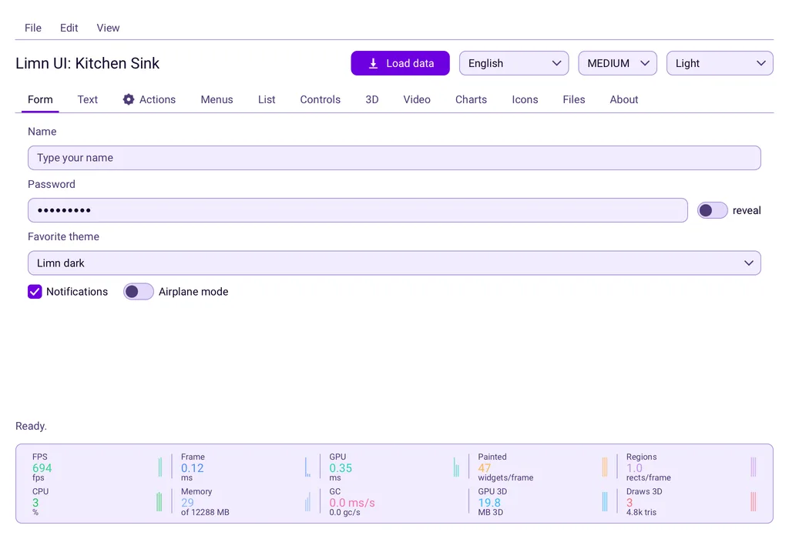
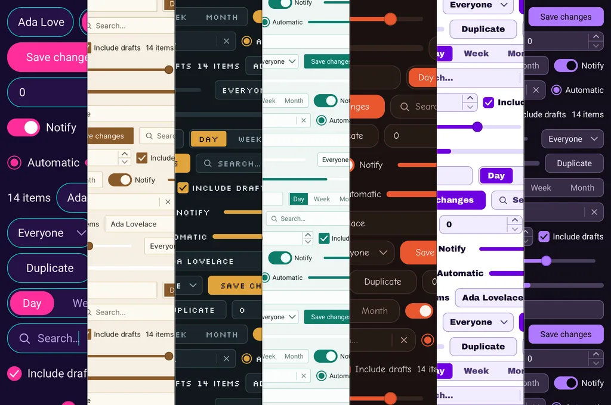
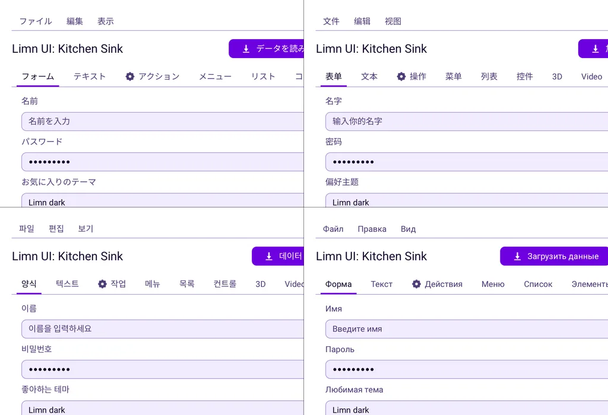

<p align="center">
  <picture>
    <source media="(prefers-color-scheme: dark)" srcset="media/readme/lockup-dark.svg">
    
  </picture>
</p>

<p align="center"><b>用 Java 寫桌面應用程式，像素自己畫。</b></p>

<p align="center">
  <a href="https://central.sonatype.com/artifact/io.github.limn-toolkit/limn-toolkit"></a>
  <a href="LICENSE"></a>
  
  
  <a href="https://limn-toolkit.github.io/limn-toolkit"></a>
</p>

<p align="center">
  <a href="https://limn-toolkit.github.io/limn-toolkit">網站</a> ·
  <a href="https://limn-toolkit.github.io/limn-toolkit/docs/install/">開始使用</a> ·
  <a href="https://limn-toolkit.github.io/limn-toolkit/components/">元件</a> ·
  <a href="https://limn-toolkit.github.io/limn-toolkit/api/">API 參考</a>
</p>

<p align="center">
  <a href="README.md">English</a> ·
  <a href="README.pt-BR.md">Português (Brasil)</a> ·
  <a href="README.es.md">Español</a> ·
  <a href="README.de.md">Deutsch</a> ·
  <a href="README.fr.md">Français</a> ·
  <a href="README.ja.md">日本語</a> ·
  <a href="README.ko.md">한국어</a> ·
  <a href="README.ru.md">Русский</a> ·
  <a href="README.zh-Hans.md">简体中文</a> ·
  <b>繁體中文</b>
</p>

<p align="center">
  <picture>
    <source media="(prefers-color-scheme: dark)" srcset="media/readme/showcase-kitchen-dark.webp">
    
  </picture>
</p>

Limn 自己畫出每一個像素。元件、版面、文字、圖表、媒體與 3D 視埠，只要一個相依套件，**沒有 Swing，沒有 JavaFX，底下也沒有原生工具組**。

## 立刻試試

整個陳列——每一個元件、圖表、媒體播放器、3D 視埠——一道指令就跑起來。沒有什麼要複製，也沒有什麼要裝，除了 [jbang](https://www.jbang.dev/download/)；你要是沒有 JDK，它連 JDK 一起取來。

```bash
jbang https://github.com/limn-toolkit/limn-toolkit/releases/latest/download/limn-demo-all.jar
```

在 macOS 上加 `--java-options=-XstartOnFirstThread`。這個開關只有 macOS 認得，別的系統上的 JVM 收到它會拒絕啟動。

## 安裝

```kotlin
dependencies {
    implementation("io.github.limn-toolkit:limn-backend-lwjgl:0.5.0")
}
```

<details>
<summary>Maven</summary>

```xml
<dependency>
  <groupId>io.github.limn-toolkit</groupId>
  <artifactId>limn-backend-lwjgl</artifactId>
  <version>0.5.0</version>
</dependency>
```

</details>

這一行就是全部的安裝。`limn-backend-lwjgl` 是視窗與繪製器，而它會把 `limn-toolkit`——元件、版面與場景圖——匯出給任何相依於它的東西。後端把 LWJGL 在每個桌面平台的原生庫都帶了進來，所以沒有 classifier 要挑。

> [!IMPORTANT]
> 在 macOS 上，JVM 需要 `-XstartOnFirstThread`。這是你第一天就會遇到的唯一平台怪癖，而且僅限 macOS——在其他平台上把這個旗標交給 JVM，它不會啟動。

### 播放影片

`VideoView` 就在上面那一行裡，它背後那些純 Java 的解碼器也是。那樣播得動的是 Y4M 與一個合成來源；MP4 與 Matroska 需要 FFmpeg，而它是一個獨立的相依套件，因為它是 Limn 裡唯一帶著原生負載、也帶著自己一份授權的部分。

```kotlin
dependencies {
    implementation("io.github.limn-toolkit:limn-video-ffmpeg:0.5.0")
    runtimeOnly("io.github.limn-toolkit:limn-video-ffmpeg:0.5.0:natives-macos-aarch64")
}
```

第一行帶來 Java 的部分，以及每個平台的 JNI 墊片。第二行帶來 FFmpeg 的原生庫，它們每個目標各發布一個 classifier，所以一台機器下載的大約是兩 MB，而不是全部六份：

```
natives-linux-x86_64     natives-macos-x86_64     natives-windows-x86_64
natives-linux-aarch64    natives-macos-aarch64    natives-windows-aarch64
```

若同一份建置要送到每個平台、而且無從得知它會落在哪一台機器上，就改用 `limn-video-ffmpeg-natives-all`。它不是 classifier，而是獨立的一個成品，替你把六個都列好了。也沒有什麼攔著你一次列出好幾個 classifier——要涵蓋兩個目標的套件包，就寫兩個。

把 classifier 留空，工具組照樣建置、照樣執行：解碼器會回報自己不可用，並說出它找過的平台，而所有不屬於 FFmpeg 的東西都繼續運作。這份 FFmpeg 建置採用 LGPL-2.1-或更高版本，動態連結且可替換，並在裝著它的 jar 裡帶著授權條款全文。

## 讓視窗出現在畫面上

```java
public static void main(String[] args) {
    try (Backend backend = new LwjglBackend()) {
        NativeWindow window = backend.createWindow(
                new WindowConfig("Hello, Limn", 480, 320, true, true));

        Column column = new Column();
        column.gap(12);
        column.add(new Label("A window, drawn by Limn."));
        column.add(new Button("Close").onAction(window::requestClose));

        Scene scene = new Scene(new Padding(Insets.all(24), column));
        scene.bind(window);

        backend.runEventLoop();
    }
}
```

沒有標記語言，沒有註解處理器，沒有建置外掛。元件就是你自己建構出來的物件。

## 你會得到什麼

**一套不必自己做的元件。** 按鈕、輸入欄、清單、分頁、選單、對話框、分割窗格、選色器，長條圖、折線圖與環圈圖，還有一個虛擬化清單，其中一百萬列的成本與二十列相同。每一個都從主題讀取顏色、形狀與密度。

**裝得進腦袋的版面。** 四個元件加一個標記：欄往下堆疊，列往旁鋪開，堆疊層層相覆，內距往內縮，`Expanded` 決定誰拿走剩下的空間。沒有約束求解器要設定，也沒有版面管理員要安裝。

**是你的產品觀感，不是工具包的。** 主題就是純資料——每一種顏色、圓角半徑、每個控件繼承的尺寸級距——執行時一次呼叫即可整套替換。

<p align="center">
  
</p>

**你的使用者的語言。** 文字以繪製時相同的前進量來量測，字型遞補逐字元進行，所以拉丁文、希臘文、西里爾文與中日韓文可以混在同一個字串裡，而你不必挑字體。輸入法在欄位內完成組字，編輯以字素叢集為單位移動。

<p align="center">
  <picture>
    <source media="(prefers-color-scheme: dark)" srcset="media/readme/home-languages-dark.webp">
    
  </picture>
</p>

**影片與 3D 同樣是元件。** 基於物理的 3D 視埠與影片播放器，像一般元件那樣參與合成：捲動視圖會裁切它們，堆疊會畫在它們上面，它們參與版面的方式和一個標籤沒有兩樣。

<p align="center">
  
</p>

## 讓它長成你的樣子

每一種顏色、每一個圓角、每一級尺寸都來自主題，而 `limn-theme-editor` 就是寫主題的那塊畫面。把它嵌進你自己的設定頁，或者直接跑起來：

```bash
jbang --main limn.themeeditor.ThemeEditorApp io.github.limn-toolkit:limn-theme-editor:0.5.0
```

macOS 的開關和上面一樣。它存下來的是純資料，你的應用用 `ThemeFormat` 讀回去。

## 模組

| | |
| --- | --- |
| `limn-toolkit` | 元件集、版面、場景圖、後端 SPI 與純 Java 影片解碼器；不依賴任何東西 |
| `limn-backend-lwjgl` | 那些 SPI 背後的 GLFW、OpenGL 與 stb |
| `limn-video-ffmpeg` | 透過 FFmpeg 支援 H.264/HEVC/VP9/VP8 與 AAC/Opus/Vorbis；每個桌面目標各一個 classifier |
| `limn-icons-tabler` | Tabler 圖示包，需要就用 |
| `limn-theme-editor` | 編寫主題的畫面，可嵌入你的應用程式 |

## 在你投入之前

任何工具組都有取捨。這些就是取捨，先講清楚，因為到第三週才發現，比現在讀到糟糕得多。

- **不支援複雜文字的字形排版。** 阿拉伯文、希伯來文與印度系文字需要脈絡連寫與重新排序，而文字層並未實作這些，也沒有由右至左的版面方向。這些語言的翻譯我們刻意不發布，而不是把它們畫錯。
- **沒有螢幕閱讀器橋接。** 鍵盤導覽與焦點框是完整的，但沒有向平台的無障礙 API 公開任何內容。
- **1.0 之前。** API 在各版本之間仍會變動，而 OpenGL 是唯一的繪製路徑。請鎖定版本並閱讀發行說明。

## 文件

[網站](https://limn-toolkit.github.io/limn-toolkit)就是文件：一份以跑得起來的程式收尾的[安裝指南](https://limn-toolkit.github.io/limn-toolkit/docs/install/)、一座[元件展示](https://limn-toolkit.github.io/limn-toolkit/components/)，其中每一張圖都是那次建置中由工具組繪製的，以及完整的 [API 參考](https://limn-toolkit.github.io/limn-toolkit/api/)。

設計決策放在 [`docs/adr/`](docs/adr/)，發布的做法放在 [`RELEASING.md`](RELEASING.md)。

## 從原始碼建置

```bash
./gradlew check          # compiles, tests and builds the Javadoc every module publishes
./gradlew :limn-demo:run # the demo application, every component in one window
```

成品的目標是 JDK 17，建置本身則在 21 上執行。在沒有 GPU 的機器上，以 GL 為底的測試會跳過，而不是失敗。

MP4 播放需要一份**不在**這個倉庫裡的原生負載——發布時會為六個平台建置它，並各發布一個 classifier。若要在本機取得，`./scripts/build-ffmpeg.sh` 大約一分鐘就能建置一份，或者 `./scripts/fetch-ffmpeg.sh` 會從已發布的 jar 解出一份。

## 授權

[Apache-2.0](LICENSE)，含明確的專利授權。每個隨附元件及其授權都列在 [`NOTICE`](NOTICE) 中；FFmpeg 解碼器採用 LGPL-2.1-或更高版本，並在它的 jar 裡帶著授權條款全文。
